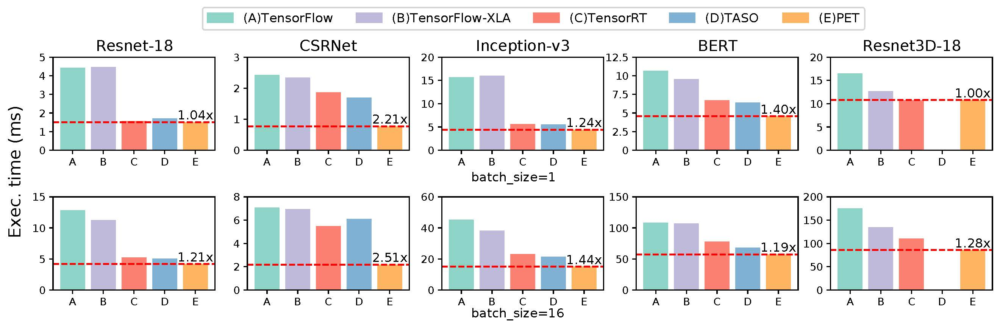

# PET: Optimizing Tensor Programs with Partially Equivalent Transformations and Automated Corrections

[PET](https://pacman.cs.tsinghua.edu.cn/~whj/pubs/Pet.pdf) is the first DNN framework that optimizes tensor programs with partially equivalent transformations and automated corrections. PET discovers and applies program transformations that improve computation efficiency but only maintain partial functional equivalence. PET then automatically corrects results to restore full equivalence. We develop rigorous theoretical foundations to simplify equivalence examination and correction for partially equivalent transformations, and design an efficient search algorithm to quickly discover highly optimized programs by combining fully and partially equivalent optimizations at the tensor, operator, and graph levels. Our evaluation shows that PET outperforms existing systems by up to 2.5$\times$, by unlocking previously missed opportunities from partially equivalent transformations.

|  |
|:--:|
| Figure 1: End-to-end performance comparison between PET and existing frameworks. For each DNN, the numbers above the PET bars show the speedups over the best baseline. TASO does not support the 3D convolution operators in Resnet3D-18. |

## Install PET

See [README.pdf](README.pdf) A.4 to install PET from source.

## Publication

Wang, Haojie, Jidong Zhai, Mingyu Gao, Zixuan Ma, Shizhi Tang, Liyan Zheng, Yuanzhi Li, Kaiyuan Rong, Yuanyong Chen, and Zhihao Jia. "PET: Optimizing Tensor Programs with Partially Equivalent Transformations and Automated Corrections." In 15th USENIX Symposium on Operating Systems Design and Implementation (OSDI 21), pp. 37-54. 2021.

## Contributors

Currently PET is maintained in a private repository. Updates will be synchronized to this repository periodically. Contributors of PET are listed as follows.

