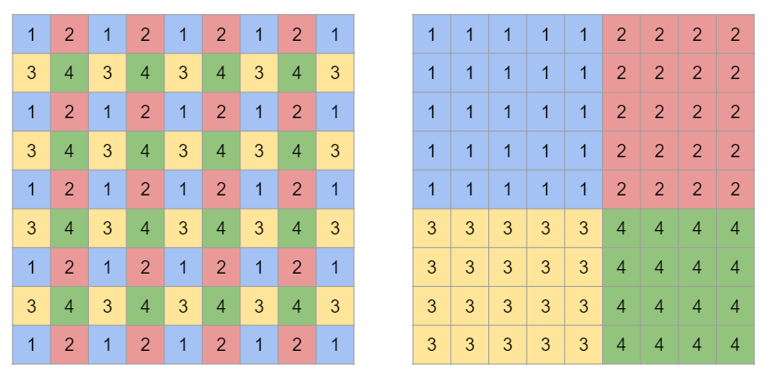

## data layout change

### 1

- `1\nhwc.py`: nhwc -> nchw
- `1\chwn.py`: chwn -> nchw
- `1\cnhw.py`: cnhw -> nchw

### 2

- `2\div4.py`: `(n, c, h, w) -> (n*4, c, h/2+padding*2, w/2+padding*2)`
- `2\div2h.py`: `(n, c, h, w) -> (n*2, c, h/2+padding*2, w+padding*2)`
- `2\div2w.py`: `(n, c, h, w) -> (n*2, c, h+padding*2, w/2+padding*2)`

### 3

- `3\rearrange.py`: 隔i行隔j列

